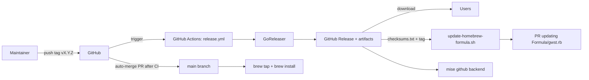
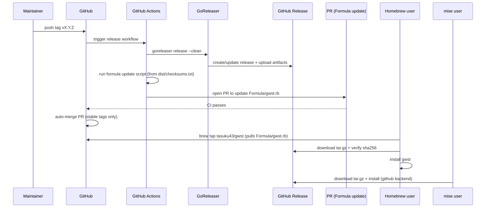

# Release pipeline architecture

This document explains the architecture and sequence of the v0.1.0 release pipeline.

## Components

- Git tag: `vX.Y.Z` (e.g. `v0.1.0`)
- GitHub Actions workflow: `.github/workflows/release.yml`
- GoReleaser config: `.goreleaser.yaml`
- GitHub Release artifacts:
  - `gwst_vX.Y.Z_macos_arm64.tar.gz`
  - `gwst_vX.Y.Z_macos_x64.tar.gz`
  - `gwst_vX.Y.Z_linux_arm64.tar.gz`
  - `gwst_vX.Y.Z_linux_x64.tar.gz`
  - `checksums.txt` (SHA256)
- Homebrew Formula: `Formula/gwst.rb`
- Formula updater script: `.github/scripts/update-homebrew-formula.sh`

## Architecture (high-level)

## Sequence (tag to install)

## Notes

- `gwst version` correctness is guaranteed for **GitHub Releases binaries** by `-ldflags` injected by GoReleaser.
- Homebrew formula is updated via a PR after each stable release tag; GitHub auto-merge is enabled by the release workflow.
- Homebrew formula updates are performed for **stable tags only** (tags without a `-...` prerelease suffix).
